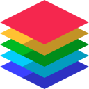

# Flixel Depth

Flixel Depth is a fun 3D _hack_ for making orthogonally 3D looking games using haxeflixel. It does so primarily by offsetting sprites according to the camera's current angle and scaling the primary game window down. This is _NOT_ real 3D, you will still be making a _2D_ game, so expect a lot of edge cases!

Check it out or contribute: [github](https://github.com/01010111/flixel-depth)

---

## DepthCamera

A depth camera is the bedrock of displaying 3D objects. It does several things under the hood - creates a container sprite that scales our FlxGame's height, sets a larger size for it's camera, and handles rotation and position of its camera. Use this Depth Camera as a dolly - move it to move your game's camera.

Let's set up a Depth Camera in our FlxState:

```
// add a few variables to help us out:
var cam:DepthCamera;
var last_mouse_x:Float;
var last_mouse_y:Float;
```

Initialize a Depth Camera and add it to your state:

```
// in your FlxState.create() function:
cam = new DepthCamera();
add(cam)
```

Use **DepthCamera.set()** and **DepthCamera.set_delta()** to operate your camera's various orbits and zoom levels:

```
// in your FlxState.update() function:
cam.set_delta(
	// sets horizontal orbit with mouse x position
	FlxG.mouse.pressed ? (last_mouse_x - FlxG.mouse.screenX) / 8 : 0,
	// sets vertical orbit with mouse y position
	FlxG.mouse.pressed ? (FlxG.mouse.screenY - last_mouse_y) / 32 : 0,
	// sets camera zoom with mouse wheel
	FlxG.mouse.wheel * 0.025
);

last_mouse_x = FlxG.mouse.screenX;
last_mouse_y = FlxG.mouse.screenY;
```

You can use **DepthCamera.screen_to_world()** to translate a point from screen space to world space:

```
var mouse_world_position = cam.screen_to_world(FlxG.mouse.getPosition());
```

---

## DepthSprite

A Depth Sprite is the primary Sprite class for our 3D environment. All other depth sprite classes extend it. It has a few variables to be aware of:
- **DepthSprite.z** - set the vertical position of the sprite. The higher the number, the higher the sprite will appear above your origin plane.
- **DepthSprite.dy** - depth y - kind of a screenspace Y that is used for sorting sprites on screen.

---

## DepthGroup

Just a FlxTypedGroup for DepthSprites. Recommended to add all of your depth sprites to an instance for sorting! Use **DepthGroup.depth_sort()**.

---

## PlaneSprite

A Plane Sprite is like a normal FlxSprite, except it lives on the Z Axis. It appears to stand straight up! Note that changing **PlaneSprite.angle** still rotates the sprite around the Z Axis, but because it appears to stand up straight, it spins the plane around to face different directions. You can always check to see if the plane is facing the camera or not using **PlaneSprite.facing_camera**.

---

## BillboardSprite

A Billboard Sprite appears to always face the camera - it can either be similar to a PlaneSprite or you can switch **PlaneSprite.scale_with_cam** to false and it will appear as though it's a flat sprite regardless of the camera angle.

---

## StackSprite

A Stack Sprite appears to have depth by stacking one sprite on top of another.

Load in a sprite sheet using **StackSprite.loadGraphic()** and if the sprite sheet has all of the slices in order, you can use **StackSprite.auto_stack()** to stack them automatically.

```
var stack_sprite = new StackSprite();
stack_sprite.loadGraphic(Assets.sprite_sheet__png, true, 16, 16);
stack_sprite.auto_stack();
```

Or you can set the indeces of frames in **StackSprite.slices[]** manually.

```
stack_sprite.slices = [0, 1, 2, 8, 9, 10];
```

You can change the gap between slices by changing **StackSprite.gap**

```
stack_sprite.gap = 0; // flatten the stack
stack_sprite.gap = Math.PI * 2; // make the stack appear twice as tall
```

If you're ok with the extra draw calls and want to hide the space between slices, you can change the level of detail using **SpriteStack.lod**. This will multiply the amount of times a slice is drawn in the stack.

```
stack_sprite.lod = 4;
```

You can offset the rotation of a slice (and all of the subsequent slices) by setting the appropriate index of **StackSprite.angle_offsets[]**.

```
stack_sprite.angle_offsets[4] = 90;
```

---

## BillboardText

While not a DepthSprite (thank you OOP), Billboard Text is a handy text class that uses FlxText and a similar drawing method to BillboardSprite to display text at a normal scale and angle.

---

## Things to note

- Sorting is mostly handled by x/y position, and z position is taken into account so you can have objects on top of one another, but it's definitely not perfect - remember, _all the 3D is fake_!
- If something looks a little bit off, try setting the offset of depth sprite to the center of the sprite. Same goes for the origin of billboard sprites and text!

---

## Use flixel-depth

To use flixel-depth in your own projects, you can install it via haxelib:

```
haxelib git flixel-depth https://github.com/01010111/flixel-depth.git
```